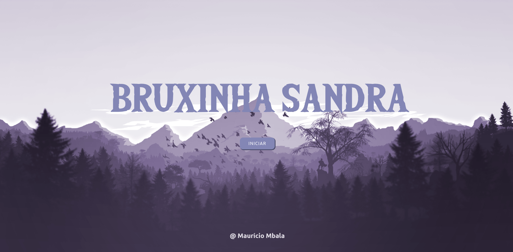

# BruxinhaSandra-Gamer
Este é um jogo 2D desenvolvido por mim `Mauricio Mbala` usando P5JS e JavaScript
#


O jogo só rola em um servidor, para isso podes criar um servidor local com a extenção do VScode ou PHP
Para criar um servidor PHP tens que ter o php instalado na sua maquina e digite o seguintes comandos

```php 
php -S localhost:5500 

```

Depois de criar o servidor vá no navegador e digite `localhost:5500`

# Jogo rolando 


# Fim de jogo 


<footer>Copyright &copy; Maurício Mbala - Todos os Direitos Reservados</footer>
